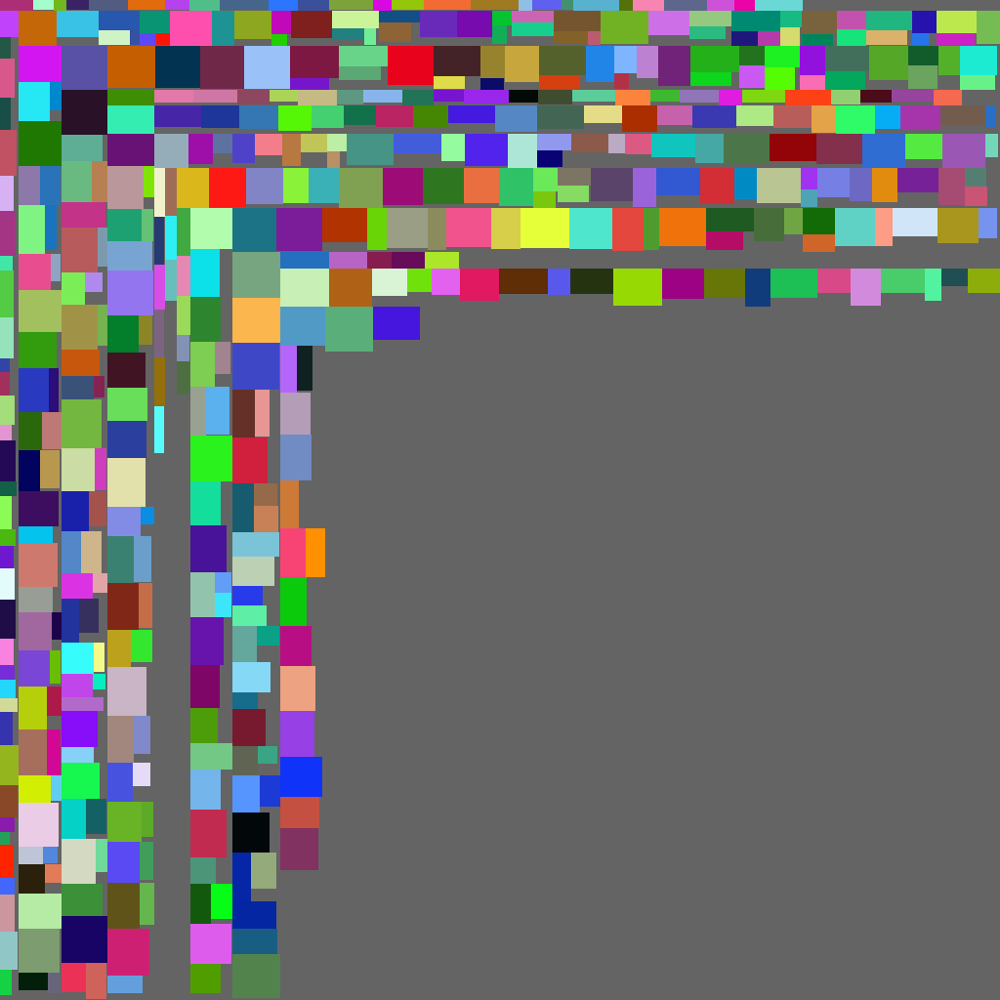

# Bin-packing problem
This project demonstrates a solver for bin-packing problem.<br>
We utilize <a href="http://blackpawn.com/texts/lightmaps/default.html">this</a> algorithm.



## Getting Started
### Prerequisties
C++ is required to build.

### Installation
Just download/clone all .h/.cpp files.

### Example
Same example is shown in main.cpp.

To pack multiple images, use "ImagePacker" class,
```cpp
#include "imagePacker.h"
...
ImagePacker packer(1024, 1024);
```

and call "insert" method.

```cpp
Image img;
... setting img color, width/height

int id = 0;
if (packer.insert(image, id))
{
    ...
}
```
"insert" method returns true and assign id when success to insert.

Once success to insert an image to the packer, you can access a node with ID.
```cpp
auto* nodePtr = packer.getNode(id);
```

Finally, to save the atlas image, call "save()" method.
```cpp
packer.save("result.bmp");
```

## Author
nossey

## License
This project uses <a href="http://cimg.eu/">CImg</a> library for image process.<br>
<a href="http://cimg.eu/">CImg</a> is distributed under <a href="http://www.cecill.info/">CeCILL License</a>

(If you want to use your own image library, please modify "Image" class and related functions. (e.g. Image.getWidth(), fillPixel(), ...))

## Disclaimer
This project is free for use.<br>
But we do not take any responsibilities for any risks and damages by using this project codes.